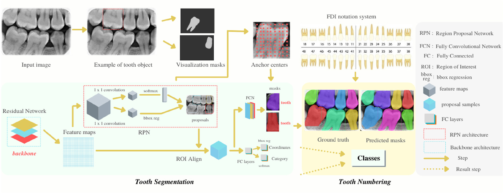

# An enhanced tooth segmentation and numbering according to FDI notation in bitewing radiographs
### This study was published in 2022 in a scientific journal with SCI-Expanded index.

Bitewing radiographic imaging is an excellent diagnostic tool for detecting caries and restorations that are difficult to view in the mouth, particularly at the molar surfaces. Labeling radiological images by an expert is a labor-intensive, time-consuming, and meticulous process. A deep learning-based approach has been applied in this study so that experts can perform dental analyzes successfully, quickly, and efficiently. Computer-aided applications can now detect teeth and number classes in bitewing radiographic images automatically. In the deep learning-based approach of the study, the neural network has a structure that works according to regions. A region-based automatic segmentation system that segments each tooth using masks to help to assist analysis as given to lessen the effort of experts. To acquire precision and recall on a test dataset, Intersection Over Union value is determined by comparing the model's classified and ground-truth boxes. The chosen IOU value was set to 0.9 to allocate bounding boxes to the class scores. Mask R–CNN is a method that serves as instance segmentation and predicts a pixel-to-pixel segmentation mask when applied to each Region of Interest. The tooth numbering module uses the FDI notation, which is widely used by dentists, to classify and number dental items found as a result of segmentation. According to the experimental results were reached 100% precision and 97.49% mAP value. In the tooth numbering, were obtained 94.35% precision and 91.51% as an mAP value. The performance of the Mask R–CNN method used has been proven by comparing it with other state-of-the-art methods.

# Model

<figure>
<p align="center">
    
</p>
<figcaption align="center"><b>Figure 1: System architecture and model pipeline workflow - graphical abstract</b></figcaption>
</figure>


# Citation
If you use this research paper, please cite:

Tekin, B. Y., Ozcan, C., Pekince, A., & Yasa, Y. (2022). An enhanced tooth segmentation and numbering according to FDI notation in bitewing radiographs. Computers in Biology and Medicine, 146, 105547.

```
@article{tekin2022enhanced,
  title={An enhanced tooth segmentation and numbering according to FDI notation in bitewing radiographs},
  author={Tekin, Buse Yaren and Ozcan, Caner and Pekince, Adem and Yasa, Yasin},
  journal={Computers in Biology and Medicine},
  volume={146},
  pages={105547},
  year={2022},
  publisher={Elsevier}
}
```

# Request Full Paper

Please click to access the academic paper; https://www.researchgate.net/publication/360235098_An_enhanced_tooth_segmentation_and_numbering_according_to_FDI_notation_in_bitewing_radiographs

To receive the original full text of the article, please send an e-mail to bytekin@kastamonu.edu.tr. Your email must be sent from a legitimate corporate account and contain the following text (copy and paste the text below into the required fields):

"Subject:" **Article full text download request**.

Your name: [first and last name]

Membership: [University where you work]

Department: [your department]

Email: [must be email at the institution mentioned above]

I have read and agree to abide by the following terms and conditions: Use of the article is defined by the following terms:

This article is provided "AS IS" without warranty of any kind, express or implied. Although every effort has been made to ensure accuracy, the owner of the article assumes no responsibility for errors or omissions;

Without the express consent of the author, any of the following will be deemed illegal: redistribution, modification and commercial use of this dataset in any form or form, in whole or in part;

All images in this article are only allowed to be shown in academic publications and presentations;

This article will be used for research purposes only. I will not make any part of this article available to third parties. I will not sell any part of this article or make any profit from its use.

[signature]"

Note: A link to the article file will be sent as soon as possible.
